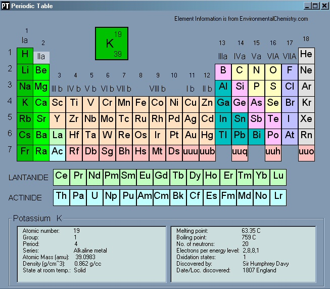



## Periodic Table X26

### Description

A Periodic table that displays 26 attributes per element using a label array.
 
### More Info
 
Another Periodic Table - this one has 26 attributes per element. The selection and display routines are compact enough. The Load arrays routines proved that you can only get 64K of code into one subroutine (who knew that?). Although spread out, the Load Arrays routine shortened the manual data inputing to a mere 10 hours. Still there has to be a more compact way to load arrays?

             |
---                |---
**Submitted On**   |2003-07-20 20:56:04
**By**             |[Vic Richardson](https://github.com/Planet-Source-Code/PSCIndex/blob/master/ByAuthor/vic-richardson.md)
**Level**          |Beginner
**User Rating**    |4.2 (21 globes from 5 users)
**Compatibility**  |VB 6\.0
**Category**       |[Complete Applications](https://github.com/Planet-Source-Code/PSCIndex/blob/master/ByCategory/complete-applications__1-27.md)
**World**          |[Visual Basic](https://github.com/Planet-Source-Code/PSCIndex/blob/master/ByWorld/visual-basic.md)
**Archive File**   |[Periodic\_T1618027212003\.zip](https://github.com/Planet-Source-Code/vic-richardson-periodic-table-x26__1-47041/archive/master.zip)

